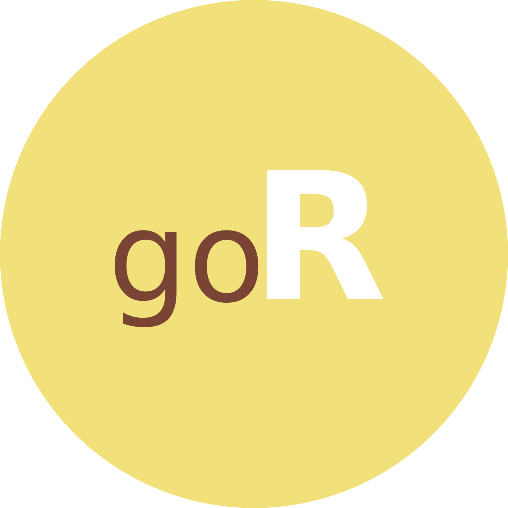

# goR

A Go """binding""" tool to R

<div align = "center">
<br>

<br>
<br>

[](https://saythanks.io/to/lucas.carotta%40outlook.com)

[](./README.md)
[](./README.pt-br.md)

[](https://www.r-project.org/)
[](https://golang.org/)
[](https://www.docker.com/)
[](https://code.visualstudio.com/)
[](https://github.com/Fazendaaa/goR/LICENSE.html)
[](https://github.com/Fazendaaa/goR/releases/)

</div>

## Intro

A year after starting [TypeR](https://github.com/Fazendaaa/TypeR), I've decided to do something that the idea was born at that time... A binding tool to allow R users to call Go code, kinda like [RCPP](http://adv-r.had.co.nz/Rcpp.html) does it.

This project also is in the same state as [shakeR](https://github.com/Fazendaaa/shakeR).

## Install

**DON'T USE IT YET** -- STILL IN DEVELOPMENT:

```shell
devtools::install_github('Fazendaaa/goR')
```

## Docker

You can use this package through its [Docker image](https://hub.docker.com/repository/docker/fazenda/gor) so you can test it:

```shell
docker run -it --volume $(pwd):/test --user $(id -u):$(id -g) --workdir /test fazenda/gor /bin/ash
```

This command will prompt you an image container all the needed system binaries and the package itself. Supported architectures to run this project are:

- 386
- amd64
- arm/v6
- arm/v7
- arm64/v8
- s390x
- ppc64le

## Author

- [Fazendaaa](https://github.com/Fazendaaa)

## TODO

- Code related:
  1. Create a "from-to" types table
  2. Create a rule to only compile source code under `src/go`
- Docs related:
  - Translate the docs to Brazilian Portuguese
  - Write a "contributing" guideline
- Other:
  - Deploy it in CRAN

## License

Released under [GNU Public License V2](./LICENSE)

## References
